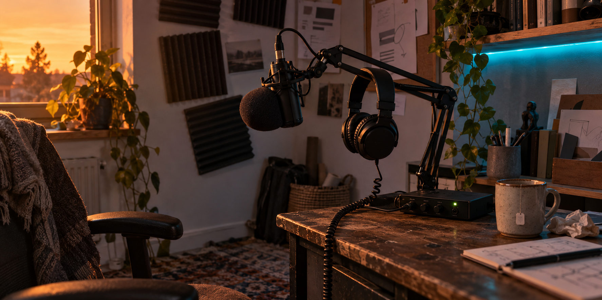
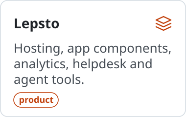
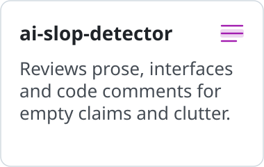
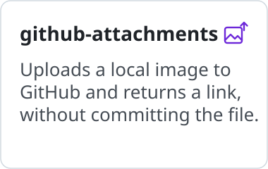
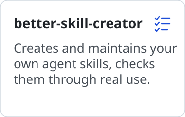

<h3 align="center">Lepsto gives solo founders hosting, app components, analytics, helpdesk, and agent tools to get products to customers faster.</h3>

<a href="https://lepsto.com/">lepsto.com</a> · <a href="https://docs.lepsto.com/">docs.lepsto.com</a>

 

I'm acting CEO of Apliteni and build Lepsto and many other cool things.

<a href="https://lepsto.com/"><picture><source media="(prefers-color-scheme: dark)" srcset="assets/tile-lepsto-dark.svg"></picture></a>
<a href="https://github.com/asabirov/ai-slop-detector-skill"><picture><source media="(prefers-color-scheme: dark)" srcset="assets/tile-slop-dark.svg"></picture></a>
<a href="https://github.com/asabirov/github-attachments-skill"><picture><source media="(prefers-color-scheme: dark)" srcset="assets/tile-attach-dark.svg"></picture></a>
<a href="https://github.com/asabirov/better-skill-creator-skill"><picture><source media="(prefers-color-scheme: dark)" srcset="assets/tile-skills-dark.svg"></picture></a>

Reach me on [LinkedIn](https://www.linkedin.com/in/asabirov/) or [X](https://x.com/artsabirov) if you want to talk.
